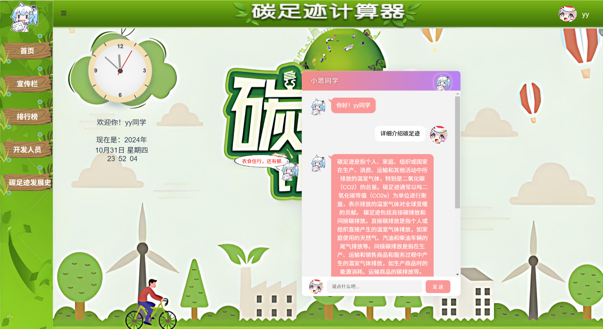
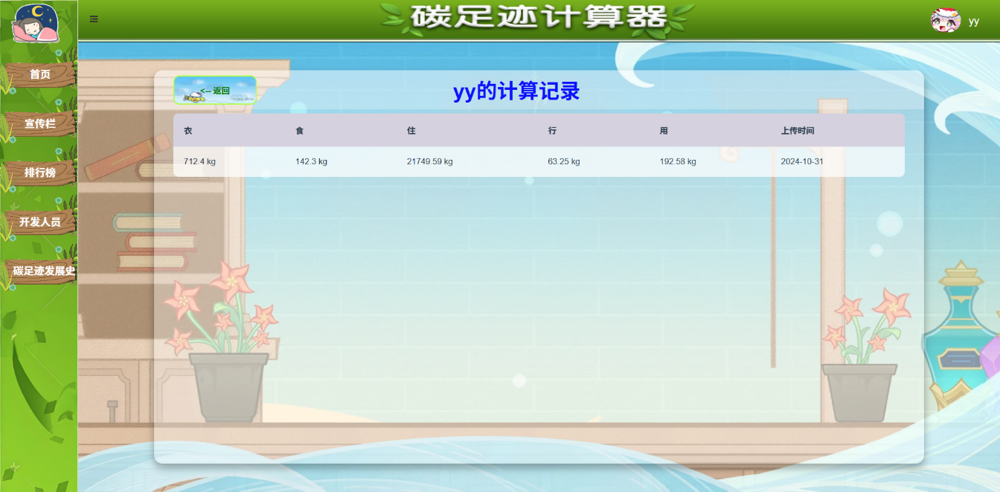
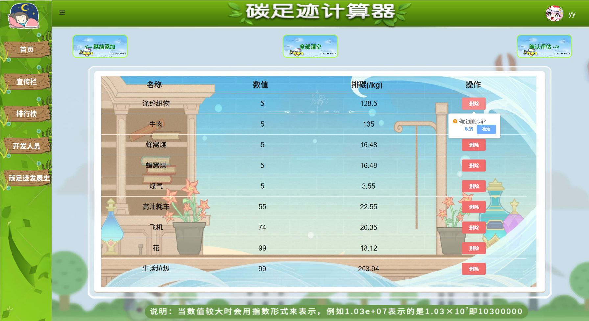
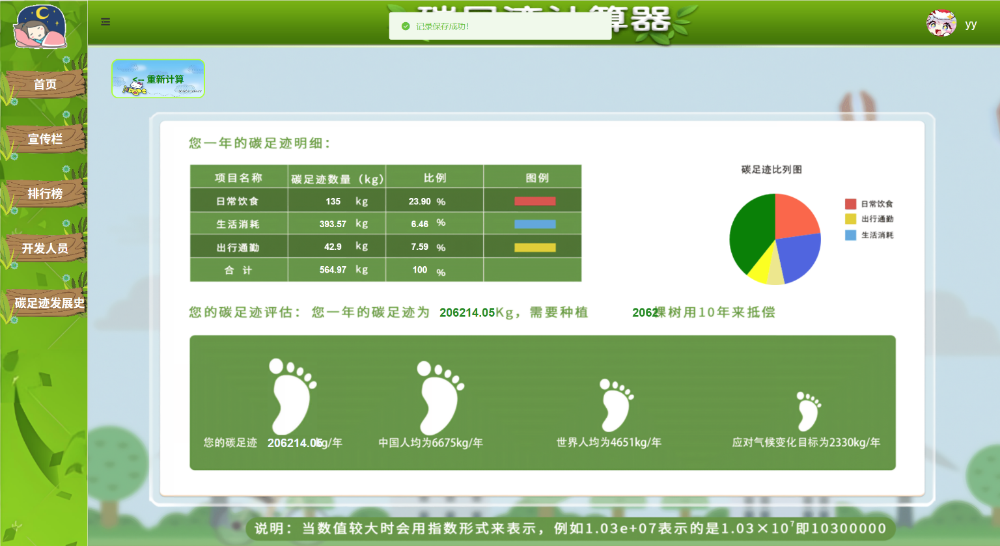
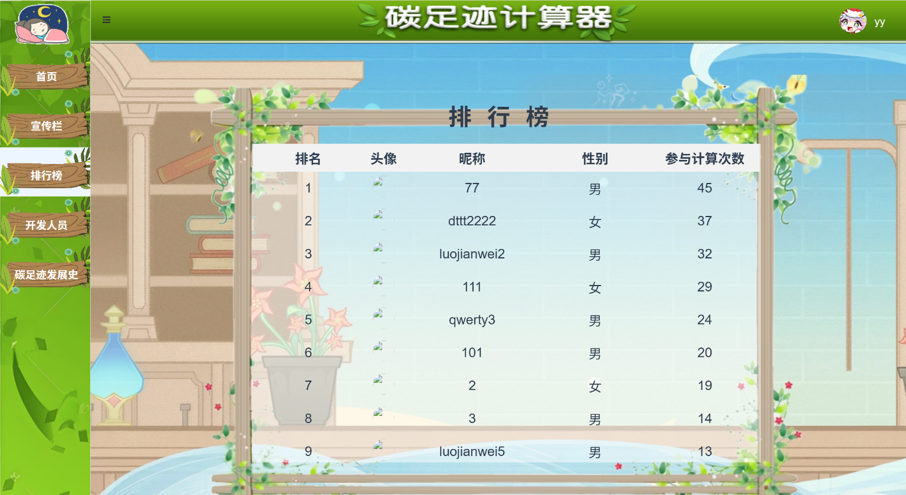
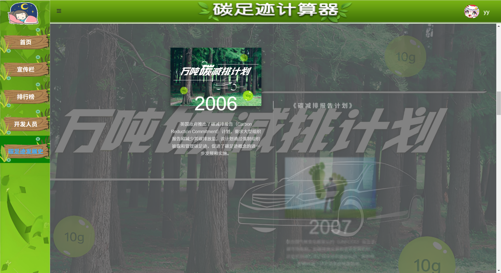

# carbon-footprint
基于Vue2 + Router + Element UI 前后端分离的碳足迹计算器大作业

## Project setup
```
npm install
```

### Compiles and hot-reloads for development
```
npm run serve
```

### Compiles and minifies for production
```
npm run build
```

## 🎬 页面展示
[登录注册]


[主页]


[点击左上角人物触发聊天机器人]



[个人主页]


[碳足迹计算记录]



[碳排放计算页面]


[碳足迹清单]



[碳排放结算页面]



[宣传栏]


[排行榜]



[碳足迹发展史]




